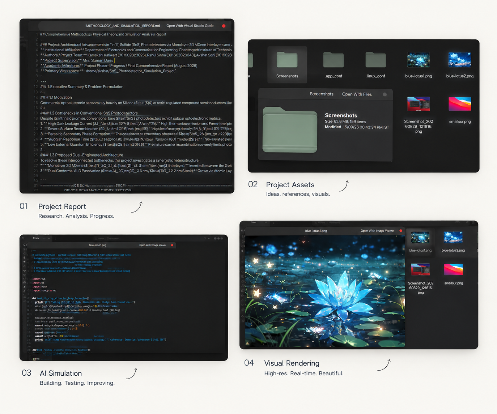
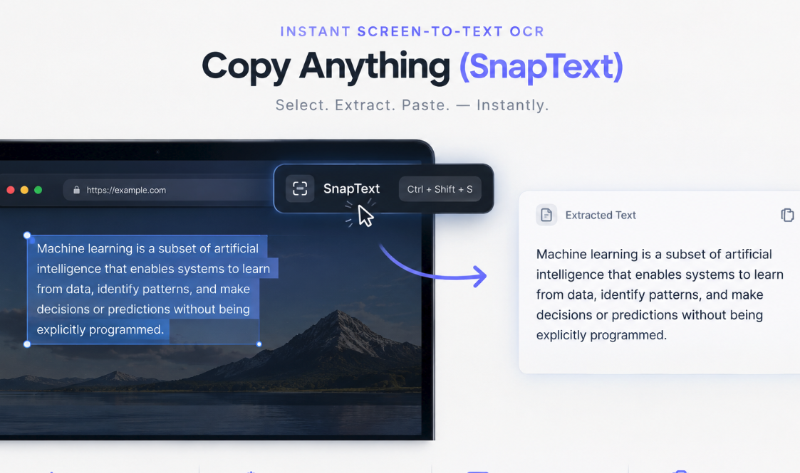
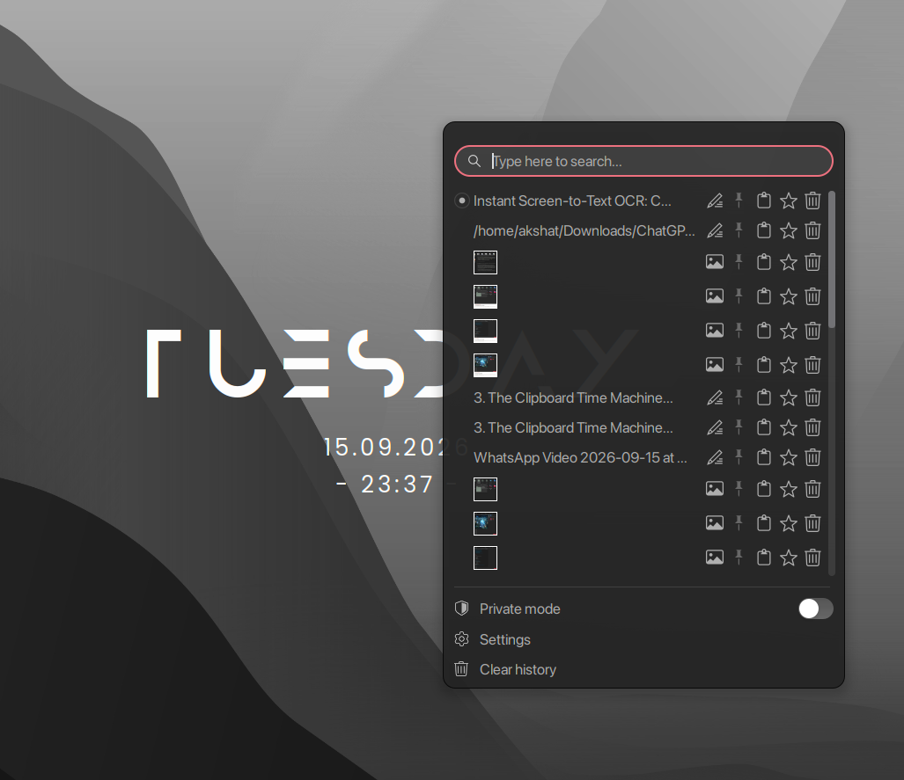
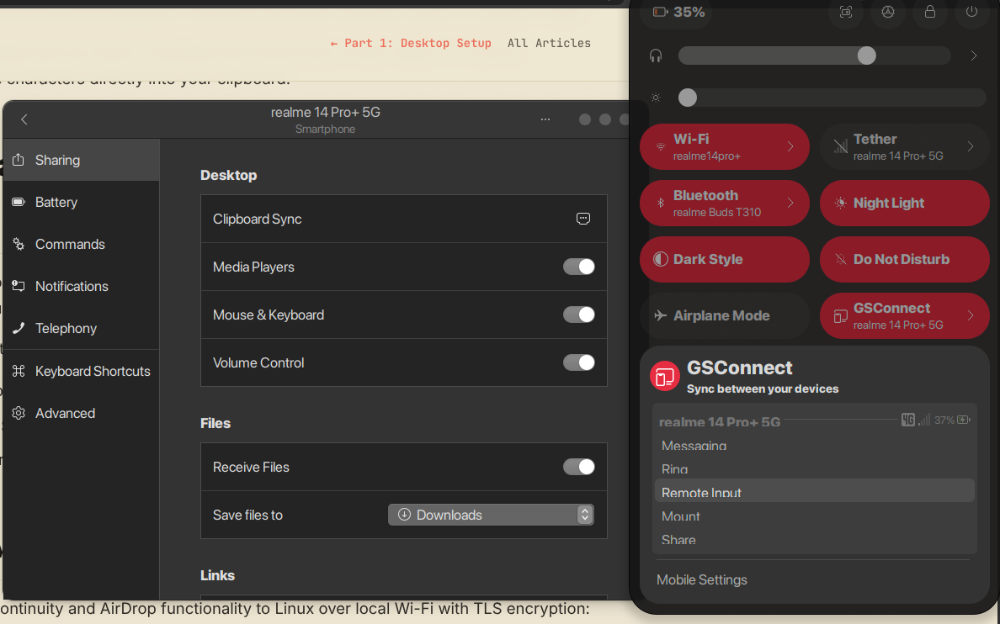
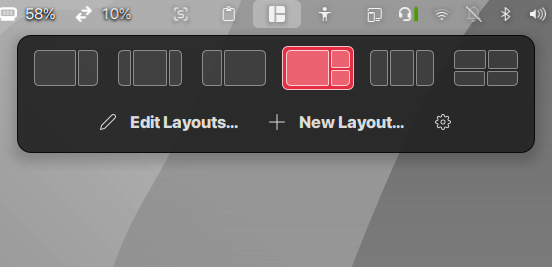
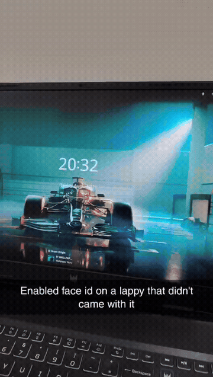

# How I Made My Linux PC Insanely Productive: The Hidden Power Features, Quick Look, and Workflow Superpowers

*By Akshat & The Linux Workstation Engineering Team*

---

A clean-looking desktop with a dark theme and a floating dock is great, but aesthetics alone don't write code, finish research papers, or keep you in flow state during a 12-hour workday.

When people switch from macOS or Windows to Linux, they usually expect great developer tooling. What catches them off guard is the loss of small, invisible quality-of-life features: **spacebar file previews, screen OCR, clipboard history, instant phone sync, and seamless gestures.**

Over the past year, I fine-tuned my Linux workstation (Ubuntu 24.04 LTS / GNOME 46 on an Acer Predator) to not only match the best productivity features of macOS and Windows, but genuinely outperform them. 

Here is the deep-dive breakdown of the exact features, extensions, keyboard shortcuts, and kernel tweaks that turned my PC into an effortless productivity powerhouse.

---

## 1. The Spacebar Quick Look: Instant File Previews (`gnome-sushi`)

### The Problem
On standard Linux setups, checking what's inside a file is clumsy. You double-click a multi-megabyte PDF, wait 3 seconds for Document Viewer to launch, realize it’s the wrong version, close it, and repeat. Or you open VS Code just to see a 10-line config file, or launch VLC just to preview a 5-second screen recording.

### The Superpower
If you've ever used macOS, you know **Quick Look**: you click any file, hit <kbd>Space</kbd>, and a high-speed preview pops up instantly. Hit <kbd>Space</kbd> again or <kbd>Esc</kbd>, and it vanishes.

On Linux, this exact superpower is powered by **GNOME Sushi**.

### See It In Action: The 4-in-1 Preview Superpower

Tap <kbd>Space</kbd> on any document, folder, script, or image in Nautilus to trigger an instant hardware-accelerated preview overlay:



1. **01 Project Report:** Instant rendering of Markdown (`.md`), PDFs, and documents with formatted headers and tables without launching an office suite.
2. **02 Project Assets:** Instant folder inspection showing recursive item counts (159 items), disk size (63.6 MB), and timestamps without opening slow property dialogs.
3. **03 AI Simulation / Code:** Syntax-highlighted code (`.py`, `.js`, `.json`, `.sh`) with line numbers and imports without opening an IDE.
4. **04 Visual Rendering:** Instant display of high-resolution artwork and photography (`16.8 MB`) in under 80ms with full color accuracy.

### What Sushi Can Preview in 100ms
* **High-Res Images & SVGs:** Opens instantaneously with full zoom, dimension metadata, and color profiles.
* **Code & Config Files (`.py`, `.js`, `.json`, `.yml`, `.sh`, `.cpp`, `.md`):** Displays syntax-highlighted code with line numbers without launching an IDE.
* **PDFs & Office Documents:** Lets you scroll through multi-page PDF documents right in the overlay.
* **Audio & Video:** Streams audio files with a live scrubber waveform and plays video clips immediately.
* **Directories & Zip Archives:** Shows folder item count, total recursive size, and modified timestamps at a glance.

### Muscle Memory Trick
Select a file, hit <kbd>Space</kbd>, and use your **Up / Down Arrow Keys** to rapidly cycle through a folder of screenshots or documents. The preview updates in real time without ever opening a window.

### How to Install
```bash
sudo apt update
sudo apt install gnome-sushi
# Restart Nautilus file manager to register the extension
nautilus -q
```

---

## 2. Instant Screen-to-Text OCR: Copy Anything You See (`SnapText`)

### The Problem
The web and desktop are full of "uncopyable" text:
- Error messages in modal dialog boxes that don't allow text selection.
- Code snippets inside paused YouTube tutorial videos.
- Architecture diagrams, mockups, or PNG flowcharts.
- Locked or scanned PDF documents.

Retyping long compiler stack traces or complex URLs character-by-character is a complete waste of human focus.

### The Superpower
I added **SnapText**, an on-screen optical character recognition (OCR) engine integrated into the GNOME Shell.



* **Shortcut:** Hit your custom hotkey (`Ctrl + Shift + S` or click the SnapText icon in the top panel).
* **Action:** Drag a crosshair marquee over *any* area on your screen — a video frame, an image, or a blocked webpage.
* **Result:** Within 200 milliseconds, the text is recognized via Tesseract OCR and automatically placed into your system clipboard, accompanied by a subtle confirmation sound.

### Real-World Use Cases
1. **Grabbing terminal commands from video streams** during tech conferences.
2. **Copying hexadecimal memory addresses or API keys** displayed in locked web portals.
3. **Extracting error text from graphical installers** to Google the solution instantly.

---

## 3. The Clipboard Time Machine (`Clipboard Indicator`)

### The Problem
The default single-item clipboard is dangerous. You copy a complex regex pattern, switch windows, instinctively press `Ctrl+C` on a URL, and your regex is erased from existence.

### The Superpower
**Clipboard Indicator** sits unobtrusively in the top status bar and acts as an indexed clipboard history manager:



* **Instant Access:** Press <kbd>Super</kbd> + <kbd>V</kbd> to open a searchable dropdown of your last 50 copied items.
* **Text & Image Thumbnails:** Stores code snippets, URLs, file paths, and copied images with live visual previews.
* **Search-as-you-type:** Type a keyword to immediately find a code block or URL you copied two hours ago.
* **Pinned Favorites:** Pin frequent snippets — like your SSH public key, common boilerplate scripts, or standard markdown headers — so they never roll off the history stack.
* **Privacy & Security:** One-click history clear, with an optional private mode toggle that suspends clipboard recording when entering sensitive credentials or password vaults.

---

## 4. Seamless Phone-to-Desktop Integration (`GSConnect`)

### The Problem
Constantly picking up your smartphone to check two-factor authentication (2FA) SMS codes, transfer a photo you just took, or reply to a quick message is the #1 enemy of deep work.

### The Superpower
**GSConnect** is the complete, native GNOME Shell implementation of the KDE Connect protocol. It bridges your Android phone (or iPhone via KDE Connect iOS) with your Linux workstation completely wirelessly over local Wi-Fi with TLS encryption.



### What It Does Automatically
| Feature | Everyday Workflow |
| :--- | :--- |
| **Shared Clipboard** | Copy a 2FA code or URL on your phone → Press `Ctrl+V` immediately on your PC. |
| **Desktop Notifications** | Incoming phone calls, WhatsApp, and SMS pop up as native GNOME notifications. You can reply directly from the desktop banner. |
| **AirDrop-Style File Drops** | Right-click any file in Nautilus → **"Send to Phone"**, or share from phone gallery directly to PC with zero cloud upload. |
| **Smart Media Pause** | When your phone rings, music playing in Spotify or VLC on your PC automatically pauses, and resumes when you hang up. |
| **Remote Trackpad & Presenter** | Use your phone touchscreen as a wireless mouse or slide-deck clicker during presentations. |

---

## 5. Modern Smart Window Tiling (`Tiling Shell`)

### The Problem
Manual window floating is messy; resizing windows by their 1px borders feels archaic. On the other hand, keyboard-only tiling window managers (i3, Sway, Hyprland) require memorizing dozens of key combos and often break system dialogs, screen sharing, and multi-monitor setups.

### The Superpower
**Tiling Shell** brings the modern grid snap experience (similar to Windows FancyZones or macOS Rectangle) directly into GNOME Mutter:



* **Visual Snap Zones:** Drag any window toward an edge or corner to see translucent snap zones (halves, thirds, 2x2 grids, or customized asymmetric splits).
* **Inner & Outer Gaps:** Subtle 4px padding between windows prevents visual overlap and gives the workspace room to breathe.
* **Quick Keyboard Snapping:**
  - <kbd>Super</kbd> + <kbd>Left / Right</kbd>: Perfect 50/50 splits.
  - Custom grid bindings for 3-column wide-monitor layouts (Code editor center, browser left, terminal right).
* **Edge Snapping Without Friction:** Windows smoothly magnetize to each other when resized together.

---

## 6. Distraction-Free Fullscreen with Top Bar Peeking (`peek-top-bar-on-fullscreen`)

### The Problem
When you go fullscreen in VS Code, a terminal, or a document to enter deep focus, you lose visibility of the clock, battery percentage, and incoming notifications. Having to exit fullscreen just to check the time breaks momentum.

### The Superpower
**Peek Top Bar on Fullscreen** creates an intelligent edge trigger:
- While working in fullscreen, the top bar is completely hidden for 100% screen immersion.
- Need to check the time or battery level? Simply **nudge your mouse cursor against the top edge of the display**.
- The top panel gracefully slides down like a subtle shade, displays your status indicators, and slides away when your cursor leaves.

---

## 7. Mac & iPhone-Style Live Face Unlock & Cold Boot Lockscreen

### The Problem
Standard Linux login screens (GDM / LightDM) are flat, static, and require typing a 12-character master password every time you walk away to grab a coffee. On the other hand, naive camera unlock scripts abruptly throw you into your open workspace before you're even seated.

### The Superpower
We engineered a **Live Lock Screen with Apple-style biometric face unlock**:



> 🎬 **High-Definition Video Recording:** [`face-id-unlock-demo.mp4`](face-id-unlock-demo.mp4) *(Live camera recognition and smooth keyboard entry)*

1. **Live Motion Wallpaper & Clock:** Waking the machine displays an atmospheric live wallpaper with centered typography and system status.
2. **Non-Intrusive Infrared Face Recognition:** When you sit in front of the laptop, the camera identifies your face in less than 300ms using Howdy PAM.
3. **The iPhone-Style "Unlocked" Badge:** Instead of jarringly flashing the desktop open immediately, it displays a sleek glass pill badge:  
   `🔓 Unlocked — Press any key to open`
4. **Muscle-Memory Entry:** Tapping <kbd>Space</kbd>, clicking the mouse, or swiping up glides smoothly into your running apps.
5. **Instant Fallback:** If lighting is poor or you're wearing a mask, a visible **`[ 📷 Retry Face Scan ]`** button and instant password fallback are available.

---

## 8. Bluetooth Peripheral Battery Telemetry (`Bluetooth-Battery-Meter`)

### The Problem
Bluetooth headphones, mice, and keyboards usually give zero warning before dying in the middle of a crucial Zoom meeting or deployment.

### The Superpower
The **Bluetooth Battery Meter** extension queries the BlueZ battery interface and displays discrete battery percentages for connected peripherals right in the GNOME status tray:
* Earbuds (AirPods / Sony / Galaxy Buds) with left, right, and case percentages.
* Wireless productivity mice (Logitech MX Master) and mechanical keyboards.
* Automatic warning notifications when any device drops below 20%.

---

## 9. Touchpad Gestures & Kinetic Inertia Scrolling

### The Problem
Linux on laptops historically suffered from choppy touchpad scrolling and non-existent multi-finger gestures compared to macOS.

### The Superpower
1. **Touchégg 3-Finger & 4-Finger Navigation:**
   * **3-Finger Swipe Left / Right:** Smooth, responsive application switching (`Alt + Tab`).
   * **3-Finger Swipe Up:** Launches GNOME Overview & Workspace grid.
   * **Pinch In / Out:** Natural zoom on documents and web pages.
2. **Kinetic Momentum Scrolling (`rinertia`):**
   * Emulates physical friction and inertia. A quick flick of two fingers sends long terminal logs, code files, or web pages gliding smoothly, decelerating naturally just like on high-end smartphone screens.

---

## 10. Under-The-Hood Speed: ZRAM, Swappiness, and Compiler Boosts

Desktop responsiveness is only as good as kernel memory management. Here are the three non-visual tweaks that keep this system immune to slowdowns:

### A. ZRAM Memory Immunity (`lz4`)
Instead of swapping memory to an NVMe drive during heavy workloads, ZRAM sets up an ultra-fast compressed RAM partition.
```ini
# /etc/default/zramswap
ALGO=lz4
PERCENT=50
PRIORITY=100
```
Paired with:
```bash
sudo sysctl vm.swappiness=25
sudo sysctl vm.page-cluster=0
```
This guarantees that even with 40 browser tabs, an Android emulator, Docker, and PyTorch models running concurrently, the desktop **never freezes or disk-thrashes**.

### B. High-Speed Compiling with `mold` and `ccache`
For developers compiling C++, Rust, or Node native bindings, standard GNU `ld` is a notorious bottleneck.
* **`mold` (Modern Linker):** Links binaries up to 10x faster than default linkers.
* **`ccache` (Compiler Cache):** Caches previous builds so recompilations complete in seconds.

```bash
sudo apt install mold ccache
```

### C. Variable Refresh Rate (VRR / FreeSync / G-Sync)
To ensure all these animations (like the Compiz Magic Lamp minimize effect) stay lock-solid at 120Hz/165Hz with zero micro-stuttering:
```bash
gsettings set org.gnome.mutter experimental-features "['variable-refresh-rate']"
```

---

## The Complete Productivity Cheat-Sheet

Here is how all these features map to daily muscle memory:

| Action | Shortcut / Trigger | Under the Hood |
| :--- | :--- | :--- |
| **Instant File Preview** | <kbd>Space</kbd> (in Files) | `gnome-sushi` |
| **Screen Text OCR** | Custom Hotkey / Tray Icon | `snaptext` (Tesseract) |
| **Clipboard History** | <kbd>Super</kbd> + <kbd>V</kbd> | `clipboard-indicator` |
| **Phone Sync & Clipboard** | Background Auto-Sync | `gsconnect` (KDE Connect) |
| **Grid Snap Windows** | Drag to Edge / <kbd>Super</kbd>+<kbd>Arrows</kbd> | `tilingshell` |
| **Peek Top Bar** | Bump cursor to top of screen | `peek-top-bar-on-fullscreen` |
| **Face Unlock** | Look at camera → tap <kbd>Space</kbd> | `live-lockscreen` + Howdy |
| **App Switching** | 3-Finger Touchpad Swipe | `touchegg` |
| **AI Coding Agent** | Terminal `agyy` | Antigravity CLI |

---

## Conclusion: The Linux Workstation Advantage

The beauty of Linux is not that it comes perfect out of the box — it’s that **you have the power to eliminate every single friction point that slows you down**.

By combining:
1. **The speed of Sushi file previews**
2. **The utility of screen OCR and clipboard history**
3. **The cross-device synergy of phone sync**
4. **The elegance of smart window grids and gestures**
5. **The rock-solid stability of ZRAM memory tuning**

...you end up with an operating system that doesn't just look stunning — it disappears into the background and lets you create at the speed of thought.

---

### Resources & Repo
* **GitHub Repository:** [https://github.com/Akshatsoni005/linux-productivity-setup](https://github.com/Akshatsoni005/linux-productivity-setup)
* **Automated Installer:** `curl -fsSL https://www.theaiserver.in/downloads/setup.sh | bash`
